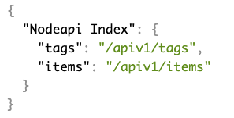

# Nodepop

<p align="">
    <a> </a>
    <a> </a>
</p>

Nodepop is an API for selling second-hand items. The service allows you to search for items through filters and create new ones. 
Also included is a web page to show and filter the items.


It is the first version and has been created within the Keepcoding Full Stack Web course.


## Prerequisites 📋
Before starting we must install several libraries:

__Nodejs__ and __MongoDB__:


If we want to start a MongoDB process, just go to the path where we have unzipped the files and execute the command:

```bash
mongod
```

## Installing 🔧

### Clone

Clone this repo to your local machine using `https://github.com/beatrizAdalab/Nodepop.git`

Now install npm 

```bash
$ npm install
```
### Run


```bash
$ npm run install-db // Initialize database
$ npm start // Development mode
$ npm run dev // Production mode
```

## API Nodepop

### Url base
The Base URL is the root URL for all of the API. If you encounter a 404 error, check the path.

```bash
http://localhost:3000/apiv1/
```

Here you can see the index.



### Tags
Get json with all available tags.

```bash
http://localhost:3000/apiv1/tags
```

### Items

Get json with all available items. By default they are limited to 5 per page.

```bash
http://localhost:3000/apiv1/items
```


Filters | GET
------------ | -------------
List by __name__ | http://localhost:3000/apiv1/items?name= __alphanumeric name__
List by __tags__ | http://localhost:3000/apiv1/items?tag= __work lifestyle motor or mobile__
Sort by __name__ or __price__ | http://localhost:3000/apiv1/items?sort= __name or price__ by default is by name (alphabetical order)
Filter by __price__ | http://localhost:3000/apiv1/items?price= __number greater than 0__
Filter by __min price__ | http://localhost:3000/apiv1/items?price=50-
Filter by __max price__ | http://localhost:3000/apiv1/items?price=-100
Filter by __min and max price__ | http://localhost:3000/apiv1/items?price=50-100
Get selected __fields__ | http://localhost:3000/apiv1/items?fields= __name price buy or photo__ separated by a space

Create a new Item | POST 
------------ | -------------
json| 
response| 


## Web Nodepop
On this website (http://localhost:3000), through your url, you can try the following:

* The list of all items
* sort, filtered by tag and price
* pagination


## Built With 🛠️
<ul>
<li>MongoDb</li>
<li>Mongoose</li>
<li>Express</li>
<li>Express-validator</li>
<li>Ejs</li>
<li>Nodemon</li>
</ul>


## License 📄
[MIT](https://choosealicense.com/licenses/mit/)

## Author ✒️
**Beatriz García** - [beatriz Garcia](https://github.com/beatrizAdalab)
